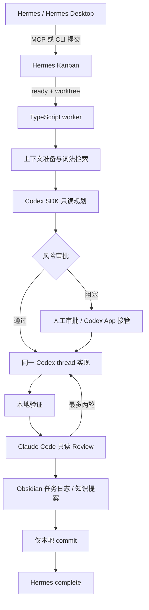

# 架构



## 组件职责

| 组件 | 职责 | 权限 |
|---|---|---|
| Hermes | 入口、任务卡、依赖、worktree、运行状态 | 创建任务和 worktree |
| TypeScript worker | 状态机、审批、超时、日志、adapter 调度 | 任务目录和 worktree |
| Codex SDK | 规划、实现、修复，同一 thread 连续工作 | 规划只读；实现 workspace-write |
| Codex App | thread、diff、进度查看及人工接管 | 由用户决定 |
| Claude Code | 独立 Review | 只读工具 |
| Obsidian | 检索上下文、任务日志、待审批知识提案 | 限定项目知识目录 |

## 状态机

`context_preparing → planning → [awaiting_plan_approval] → implementing →
verifying → reviewing → knowledge → finalizing → completed`

验证或 Review 失败进入 `fixing`，共用配置的修复预算。暂停、风险、知识提案或
预算耗尽进入 `blocked`。状态、事件、diff、验证日志、Review 和指标均保存在：

```text
<runtime>/<board>/<task-id>/
```

## Adapter 边界

Codex、Claude、Hermes、Git、验证和知识写回均通过窄接口注入控制器。将来切换
到稳定版 Hermes external worker lane 或 Codex Runtime 时，应替换 adapter，
不修改工作流状态语义。
